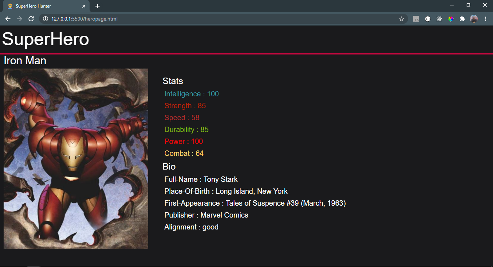

# SuperHeroHunter
A web Application dedicated to SuperHeros built using only vanilla javascript.
## [`SuperHeroHunter Demo`](https://devilzer.github.io/SuperHeroHunter/)
<h2> Features </h2>
<ul>
  <li>Search for any superhero results will update as you type.</li>
  <li>Favourite button to add or remove superhero to your list.</li>
  <li>Persistent storage for favourite hero list</li>
  <li>SuperHero Details page and Favourite Heros page</li>
</ul>
<h2>Homepage</h2>

<h2>Favourite-Heros page</h2>

<h2>SuperHero Details page</h2>

<h3>Credits:-</h3>
<a href="https://superheroapi.com/">SuperHero API</a>
 
<a href="https://fontawesome.com/">Font Awesome</a>
